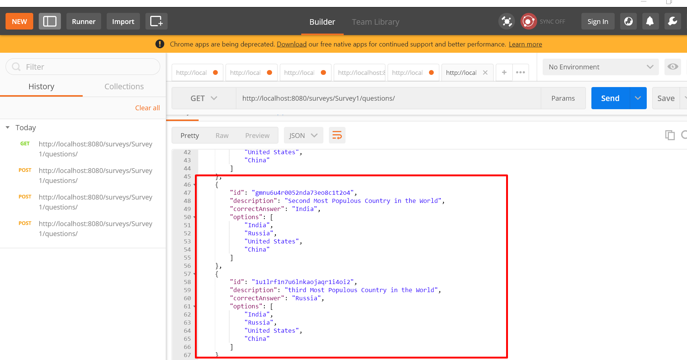

# Spring Boot Advanced Detail Level Read me

## What You Will Learn during this Step 01:
- Set up an Maven Project with Eclipse. 
- Copy Two Files pom.xml and Application.java
- Launch Your First Spring Boot Application.
- You will be introduced to Maven
- Dependency Management

### code snipet

* src/main/java/com.jd.springboot.Application

```java
package com.jd.springboot;

import org.springframework.boot.SpringApplication;
import org.springframework.boot.autoconfigure.SpringBootApplication;
import org.springframework.context.ApplicationContext;

@SpringBootApplication
public class Application {

	public static void main(String[] args) {
		ApplicationContext ctx = SpringApplication.run(Application.class, args);

	}

}
```
* pom.xml
```xml
<project xmlns="http://maven.apache.org/POM/4.0.0" xmlns:xsi="http://www.w3.org/2001/XMLSchema-instance" xsi:schemaLocation="http://maven.apache.org/POM/4.0.0 https://maven.apache.org/xsd/maven-4.0.0.xsd">
  <modelVersion>4.0.0</modelVersion>
  <groupId>com.jd.springboot</groupId>
  <artifactId>first-springboot-project</artifactId>
  <version>0.0.1-SNAPSHOT</version>
  
  <parent>
		<groupId>org.springframework.boot</groupId>
		<artifactId>spring-boot-starter-parent</artifactId>
		<version>2.3.1.RELEASE</version>
	</parent>
	
	<properties>
		<java.version>1.8</java.version>
	</properties>
	
  
  <dependencies>
		<dependency>
			<groupId>org.springframework.boot</groupId>
			<artifactId>spring-boot-starter-web</artifactId>
		</dependency>
	</dependencies>
  
  <build>
		<plugins>
			<plugin>
				<groupId>org.springframework.boot</groupId>
				<artifactId>spring-boot-maven-plugin</artifactId>
			</plugin>
		</plugins>
	</build>
  
</project>

```
---
## What You Will Learn during this Step 02
- Lets add a RestController with a dependency and see Spring Boot Magic live

## Theory Break : Quick Spring and Spring MVC Primer
- What is dependency?
- @Component
- @Autowired
- @RestController

## Useful Snippets and References

* com.jd.springboot.Application
```java
package com.jd.springboot;

import org.springframework.boot.SpringApplication;
import org.springframework.boot.autoconfigure.SpringBootApplication;
import org.springframework.context.ApplicationContext;
import org.springframework.context.annotation.ComponentScan;

@SpringBootApplication
@ComponentScan("com.jd")
public class Application {

	public static void main(String[] args) {
		ApplicationContext ctx = SpringApplication.run(Application.class, args);

	}

}
```

* com.jd.springboot.WelcomeController
```java
package com.jd.springboot;

import org.springframework.beans.factory.annotation.Autowired;
import org.springframework.web.bind.annotation.RequestMapping;
import org.springframework.web.bind.annotation.RestController;

import com.jd.service.WelcomeService;

@RestController
public class WelcomeController {

	//Auto wiring
	@Autowired
	private WelcomeService service;

	@RequestMapping("/welcome")
	public String welcome() {
		return service.retrieveWelcomeMessage();
	}
}
```
* com.jd.service.WelcomeService
```java
package com.jd.service;

import org.springframework.stereotype.Component;

@Component
public class WelcomeService {

	public String retrieveWelcomeMessage() {
		//Complex Method
		return "Good Morning updated";
	}
}
```
---
## What You Will Learn during this Step 03:
- First installment of revealing how magic happens with Spring Boot. As a Spring Boot developer, you need to understand what's happening beneath the hood of Spring Boot! 
- spring-boot-starter-web : starter for building applications with Spring MVC. Tomcat is default embedded container.
- We already added this starter in the first step! Now we will explore the features it provides
- We will enable logging in DEBUG mode to understand further

### spring-boot-starter-web
- Spring Boot Starter Web brings all dependencies needed to build normal and RESTful web applications. Look at the dependency tree. 
- All the dependencies are added in because of spring-boot-starter-web
- Also look at /META-INF/spring.provides inside the spring-boot-starter-web.jar
- Spring Boot Starter Web auto configures things needed to startup a web application. Look at the log
- Mapping servlet: 'dispatcherServlet' to [/]
- Mapped "{[/error]}" onto public org.springframework.http.ResponseEntity<java.util.Map<java.lang.String, java.lang.Object>> org.springframework.boot.autoconfigure.web.BasicErrorController.error(javax.servlet.http.HttpServletRequest)
- Mapped URL path [/webjars/**] onto handler of type [class org.springframework.web.servlet.resource.ResourceHttpRequestHandler]
- Look at package org.springframework.boot.autoconfigure.web in spring-boot-autoconfigure-*.jar
- Go to url http://localhost:8080/some-non-existing-url

### Useful Snippets
/src/main/resources/application.properties
```
logging.level.org.springframework: DEBUG
```
---
## What You Will Learn during this Step 04:
- Understand Starter Parent
- How to override things defined in Starter Parent
- Other starter projects

### Starter Parent
- Dependency Versions
- Java Versions
- Default Plugins

### Other Starter Projects
- spring-boot-starter-web-services
- spring-boot-starter-test
- spring-boot-starter-jdbc
- spring-boot-starter-security
- spring-boot-starter-data-jpa
- spring-boot-starter-data-rest
- More at https://docs.spring.io/spring-boot/docs/current-SNAPSHOT/reference/htmlsingle/#using-boot-starter

### Useful Snippets and References
First Snippet
```
    <parent>
        <groupId>org.springframework.boot</groupId>
        <artifactId>spring-boot-starter-parent</artifactId>
        <version>2.3.1.RELEASE</version>
    </parent>
```
---
## What You Will Learn during this Step 05:
- Spring Boot vs Spring
- What Spring Boot is Not!

### Spring Boot vs Spring

### Spring
- Spring is just a dependency injection framework. Spring focuses on the "plumbing" of enterprise applications so that teams can focus on application-level business logic, without unnecessary ties to specific deployment environments.
- First half of the 2000 decade! EJBs
- EJBs were NOT easy to develop. 
- Write a lot of xml and plumbing code to get EJBs running
- Impossible to Unit Test
- Alternative - Writing simple JDBC Code involved a lot of plumbing
- Spring framework started with aim of making Java EE development simpler. 
- Goals
- Make applications testable. i.e. easier to write unit tests
- Reduce plumbing code of JDBC and JMS
- Simple architecture. Minus EJB.
- Integrates well with other popular frameworks.

### Applications with Spring Framework
- Over the next few years, a number of applications were developed with Spring Framework
- Testable but
- Lot of configuration (XML and Java)
- Developing Spring Based application need configuration of a lot of beans!
- Integration with other frameworks need configuration as well!
- In the last few years, focus is moving from monolith applications to microservices. We need to be able to start project quickly. Minimum or Zero start up time
- Framework Setup
- Deployment - Configurability
- Logging, Transaction Management
- Monitoring
- Web Server Configuration

### Spring Boot
- Spring Boot makes it easy to create stand-alone, production-grade Spring based Applications that you can “just run”. 
- We take an opinionated view of the Spring platform and third-party libraries so you can get started with minimum fuss. 
- Example Problem Statements
- You want to add Hibernate to your project. You dont worry about configuring a data source and a session factory. I will do if for you! 
- Goals
- Provide quick start for projects with Spring.
- Be opinionated but provide options.
- Provide a range of non-functional features that are common to large classes of projects (e.g. embedded servers, security, metrics, health checks, externalized configuration).

#### What Spring Boot is NOT?
- It’s not an app or a web server
- Does not implement any specific framework - for example, JPA or JMS
- Does not generate code

---
## What You Will Learn during this Step 06:
- We want to prepare for creating a Rest Service 
- Survey
- Question
- SurveyService
- We use hard-coded data to get started

---
## What You Will Learn during this Step 07:
- Create a REST Service for Retrieving all questions for a survey
- Autowire SurveyService
- Create @GetMapping("/surveys/{surveyId}/questions")
- Use @PathVariable String surveyId
- http://localhost:8080/surveys/Survey1/questions/
- How does the Bean get converted to a JSON?
- Auto Configuration : If Jackson jar is on the class path, message converters are auto created! (Search in log :Creating shared instance of singleton bean 'mappingJackson2HttpMessageConverter')

### Some Theory
- What is REST?
- Architectural style for the web. REST specifies a set of constraints.
- Client - Server : Server (service provider) should be different from a client (service consumer). 
- Enables loose coupling and independent evolution of server and client as new technologies emerge. 
- Each service should be stateless.
- Each Resource has a resource identifier.
- It should be possible to cache response.
- Consumer of the service may not have a direct connection to the Service Provider. Response might be sent from a middle layer cache.
- A resource can have multiple representations. Resource can modified through a message in any of the these representations.
   
## Useful Snippets and References
- JSON View : https://jsonview.com/

code Snippet

* com.jd.springboot.controller.SurveyController

```java
package com.jd.springboot.controller;

import java.util.List;

import org.springframework.beans.factory.annotation.Autowired;
import org.springframework.web.bind.annotation.GetMapping;
import org.springframework.web.bind.annotation.PathVariable;
import org.springframework.web.bind.annotation.RestController;

import com.jd.springboot.model.Question;
import com.jd.springboot.service.SurveyService;

@RestController
class SurveyController {
	@Autowired
	private SurveyService surveyService;

	@GetMapping("/surveys/{surveyId}/questions")
	public List<Question> retrieveQuestions(@PathVariable String surveyId) {
		return surveyService.retrieveQuestions(surveyId);
	}
}
```
* com.jd.springboot.model.Question
```java
package com.jd.springboot.model;

import java.util.List;

public class Question {
	private String id;
	private String description;
	private String correctAnswer;
	private List<String> options;

	// Needed by Caused by: com.fasterxml.jackson.databind.JsonMappingException:
	// Can not construct instance of com.jd.springboot.model.Question:
	// no suitable constructor found, can not deserialize from Object value
	// (missing default constructor or creator, or perhaps need to add/enable
	// type information?)
	public Question() {

	}

	public Question(String id, String description, String correctAnswer,
			List<String> options) {
		super();
		this.id = id;
		this.description = description;
		this.correctAnswer = correctAnswer;
		this.options = options;
	}

	public String getId() {
		return id;
	}

	public void setId(String id) {
		this.id = id;
	}

	public String getDescription() {
		return description;
	}

	public String getCorrectAnswer() {
		return correctAnswer;
	}

	public List<String> getOptions() {
		return options;
	}

	@Override
	public String toString() {
		return String
				.format("Question [id=%s, description=%s, correctAnswer=%s, options=%s]",
						id, description, correctAnswer, options);
	}

	@Override
	public int hashCode() {
		final int prime = 31;
		int result = 1;
		result = prime * result + ((id == null) ? 0 : id.hashCode());
		return result;
	}

	@Override
	public boolean equals(Object obj) {
		if (this == obj)
			return true;
		if (obj == null)
			return false;
		if (getClass() != obj.getClass())
			return false;
		Question other = (Question) obj;
		if (id == null) {
			if (other.id != null)
				return false;
		} else if (!id.equals(other.id))
			return false;
		return true;
	}

}
```

* com.jd.springboot.model.Survey
```java
package com.jd.springboot.model;

import java.util.List;

public class Survey {
	private String id;
	private String title;
	private String description;
	private List<Question> questions;

	public Survey(String id, String title, String description,
			List<Question> questions) {
		super();
		this.id = id;
		this.title = title;
		this.description = description;
		this.questions = questions;
	}

	public String getId() {
		return id;
	}

	public void setId(String id) {
		this.id = id;
	}

	public String getTitle() {
		return title;
	}

	public void setTitle(String title) {
		this.title = title;
	}

	public String getDescription() {
		return description;
	}

	public void setDescription(String description) {
		this.description = description;
	}

	public List<Question> getQuestions() {
		return questions;
	}

	public void setQuestions(List<Question> questions) {
		this.questions = questions;
	}

	@Override
	public String toString() {
		return "Survey [id=" + id + ", title=" + title + ", description="
				+ description + ", questions=" + questions + "]";
	}

}
```

* com.jd.springboot.service.SurveyService
```java
package com.jd.springboot.service;

import java.math.BigInteger;
import java.security.SecureRandom;
import java.util.ArrayList;
import java.util.Arrays;
import java.util.List;

import org.springframework.stereotype.Component;

import com.jd.springboot.model.Question;
import com.jd.springboot.model.Survey;

@Component
public class SurveyService {
	private static List<Survey> surveys = new ArrayList<>();
	static {
		Question question1 = new Question("Question1",
				"Largest Country in the World", "Russia", Arrays.asList(
						"India", "Russia", "United States", "China"));
		Question question2 = new Question("Question2",
				"Most Populus Country in the World", "China", Arrays.asList(
						"India", "Russia", "United States", "China"));
		Question question3 = new Question("Question3",
				"Highest GDP in the World", "United States", Arrays.asList(
						"India", "Russia", "United States", "China"));
		Question question4 = new Question("Question4",
				"Second largest english speaking country", "India", Arrays
						.asList("India", "Russia", "United States", "China"));

		List<Question> questions = new ArrayList<>(Arrays.asList(question1,
				question2, question3, question4));

		Survey survey = new Survey("Survey1", "My Favorite Survey",
				"Description of the Survey", questions);

		surveys.add(survey);
	}

	public List<Survey> retrieveAllSurveys() {
		return surveys;
	}

	public Survey retrieveSurvey(String surveyId) {
		for (Survey survey : surveys) {
			if (survey.getId().equals(surveyId)) {
				return survey;
			}
		}
		return null;
	}

	public List<Question> retrieveQuestions(String surveyId) {
		Survey survey = retrieveSurvey(surveyId);

		if (survey == null) {
			return null;
		}

		return survey.getQuestions();
	}

	public Question retrieveQuestion(String surveyId, String questionId) {
		Survey survey = retrieveSurvey(surveyId);

		if (survey == null) {
			return null;
		}

		for (Question question : survey.getQuestions()) {
			if (question.getId().equals(questionId)) {
				return question;
			}
		}

		return null;
	}

	private SecureRandom random = new SecureRandom();

	public Question addQuestion(String surveyId, Question question) {
		Survey survey = retrieveSurvey(surveyId);

		if (survey == null) {
			return null;
		}

		String randomId = new BigInteger(130, random).toString(32);
		question.setId(randomId);

		survey.getQuestions().add(question);

		return question;
	}
}
```
---
## What You Will Learn during this Step 08:
- Adding the second method to rest service to retrieve a specific question
- This will be a very short step
- http://localhost:8080/surveys/Survey1/questions/Question1
- Different Request Methods
  - GET - Retrieve details of a resource
  - POST - Create a new resource
  - PUT	- Update an existing resource
  - PATCH - Update part of a resource
  - DELETE - Delete a resource

## Useful Snippets and References
First Snippet

* com.jd.springboot.controller.SurveyController ad method retrieveQuestion into this service
```
    @GetMapping(path = "/surveys/{surveyId}/questions/{questionId}")
    public Question retrieveQuestion(@PathVariable String surveyId,
            @PathVariable String questionId) {
        return surveyService.retrieveQuestion(surveyId, questionId);
    }
```
---
## What You Will Learn during this Step 09:
- I hate the fact that I've to stop and start the server each time. Can somebody save me?
- Yeah. Spring Boot Developer Tools
- By default, any entry on the classpath that points to a folder  will be monitored for changes.
- These will not trigger restart - /META-INF/maven, /META-INF/resources ,/resources ,/static ,/public or /templates 
- Folders can be configured : spring.devtools.restart.exclude=static/**,public/** 
- Additional Paths : spring.devtools.restart.additional-paths
- LiveReload http://livereload.com/extensions/
- Technology in progress!! So, expect a few problems!
- Programming Tip 
- Become an expert at your IDE - https://www.youtube.com/watch?v=dN9GYsG1v_c

### Useful Snippets and References
First Snippet
* pom.xml add this dependency for spring-boot-devtools
```xml 
        <dependency>
            <groupId>org.springframework.boot</groupId>
            <artifactId>spring-boot-devtools</artifactId>
            <optional>true</optional>
        </dependency>
```
---
## What You Will Learn during this Step 10:
- Create a REST Service to add a new question to survey
 - @PostMapping("/surveys/{surveyId}/questions")
 - @RequestBody Question question
 - What should be Response Status for create?
 - ResponseEntity.created(location).build()
 - ResponseEntity.noContent().build()
 - Using Postman : https://www.getpostman.com
 - URL to POST to - http://localhost:8080/surveys/Survey1/questions

## Useful Snippets and References

Sample Body for POST Request

```json
{"description":"Second Most Populous Country in the World",
"correctAnswer":"India",
"options":["India","Russia","United States","China"]}
```

First Snippet

* com.jd.springboot.controller.SurveyController add method addQuestionToSurvey
```
    // /surveys/{surveyId}/questions
	@PostMapping("/surveys/{surveyId}/questions")
	public ResponseEntity<Void> addQuestionToSurvey(@PathVariable String surveyId, @RequestBody Question newQuestion) {

		Question question = surveyService.addQuestion(surveyId, newQuestion);

		if (question == null)
			return ResponseEntity.noContent().build();

		// Success - URI of the new resource in Response Header
		// Status - created
		// URI -> /surveys/{surveyId}/questions/{questionId}
		// question.getQuestionId()
		URI location = ServletUriComponentsBuilder.fromCurrentRequest().path("/{id}").buildAndExpand(question.getId())
				.toUri();

		// Status
		return ResponseEntity.created(location).build();
	}

```
### how to use postman




---
## What You Will Learn during this Step 11:
- Understand Content Negotiation
- Accept:application/xml
- Deliver XML Responses from the REST Services
- http://localhost:8080/surveys/Survey1/questions/

## Useful Snippets and References
First Snippet

* Pom.xml add dependency for xml converter
```
        <dependency>
            <groupId>com.fasterxml.jackson.dataformat</groupId>
            <artifactId>jackson-dataformat-xml</artifactId>
        </dependency>
```

- How to use post tool for xml
- GET request for application/json set request header Key = "Accept" --> Value = "application/json"


- GET request for application/json set request header Key = "Accept" --> Value = "application/json"


- POST request for application/json set request header Key = "Content-Type" --> Value = "application/json"
   and body choose Json and put body contant
   ```
	 {"description":"Second Most Populous Country in the World",
	"correctAnswer":"Khamkheda",
	"options":["India","Russia","United States","China"]}
   ```


- POST request for application/xml set request header Key = "Content-Type" --> Value = "application/xml"
   and body choose xml and put body contant
   ```
	<Question>
    <description>Largest Country in the World</description>
    <correctAnswer>Tokyo</correctAnswer>
    <options>
        <options>India</options>
        <options>Russia</options>
        <options>United States</options>
        <options>China</options>
    </options>
   </Question>
   ```


---


