# Spring Boot Web Application Detail Level

## What You Will Learn during this Step 01:
- Lets create a simple web application using Spring Boot
- Lets run the Spring Boot Application
- There is a lot of magic happening in here! We will take a deep dive into the magic in Step 03. 

### Files List

1. /spring-boot-first-web-application/pom.xml
2. /spring-boot-first-web-application/src/main/java/com/jd/springboot/web/springbootfirstwebapplication/SpringBootFirstWebApplication.java
3. /spring-boot-first-web-application/src/main/resources/application.properties
4. /spring-boot-first-web-application/src/test/java/com/jd/springboot/web/springbootfirstwebapplication/SpringBootFirstWebApplicationTests.java

### todo.txt
```
Spring Boot Starter Parent
Spring Boot Starter Web
@SpringBootApplication
Auto Configuration
```
---
## What You Will Learn during this Step 02:
### todo.txt

```
Spring Boot Starter Parent
Spring Boot Starter Web
@SpringBootApplication
Auto Configuration
```
### Learning
- @RequestMapping(value = "/login", method = RequestMethod.GET)
- http://localhost:8080/login
- Why @ResponseBody?
- Important of RequestMapping method
- How do web applications work? Request and Response
 - Browser sends Http Request to Web Server
 - Code in Web Server => Input:HttpRequest, Output: HttpResponse
 - Web Server responds with Http Response

### Useful Snippets and References
First Snippet
```
@Controller
public class LoginController {
    @RequestMapping(value = "/login")
    @ResponseBody
    public String sayHello() {
        return "Hello World dummy";
    }
}
```
### src/main/resources/application.properties
```
logging.level.org.springframework.web: DEBUG
```
### Exercises
- Create another method with a different mapping returning some other text!
---
## What You Will Learn during this Step 03:
- Demystifying some of the magic
 - Spring Boot Starter Parent
 - Spring Boot Starter Web
 - Embedded Tomcat
 - Dev Tools

---

## What You Will Learn during this Step 04:
- Your First JSP
- There is a bit of setup before we get there!
- Introduction to View Resolver

## Exercises
- Create a new jsp and a new controller method to redirect to it!
- Play around!
### todo.txt
```
Spring Boot Starter Parent
Spring Boot Starter Web
@SpringBootApplication
Auto Configuration
Dispatcher Servlet
/login => "login"
"login" => src/main/webapp/WEB-INF/jsp/login.jsp 
Search for a view named "login"
/login => LoginController 
```

### Useful Snippets and References
First Snippet - /src/main/webapp/WEB-INF/jsp/login.jsp
```html
<html>
<head>
<title>Yahoo!!</title>
</head>
<body>
My First JSP!!!
</body>
</html>
```
Second Snippet - /src/main/resources/application.properties
```properties
spring.mvc.view.prefix: /WEB-INF/jsp/
spring.mvc.view.suffix: .jsp
logging.level.: DEBUG
```
Third Snippet : To enable jsp support in embedded tomcat server!
```xml
        <dependency>
            <groupId>org.apache.tomcat.embed</groupId>
            <artifactId>tomcat-embed-jasper</artifactId>
            <scope>provided</scope>
        </dependency>

```

Fourth Snippet : To enable jsp support in embedded tomcat server!
```java

@Controller
public class LoginController {
	
	@RequestMapping(value = "/login")
	public String sayHello()
	{
		return "login";
	}

}

```
---
## What You Will Learn during this Step 05:
- You first GET Parameter.
- Problem with using GET
- Introducing @RequestParam String name, ModelMap model

### Snippets
```java
@RequestMapping(value = "/login")
	public String sayHello(@RequestParam String name, ModelMap map )
	{
		map.put("parama1", name);
		return "login" ;
	}
```
```html
<html>
<head>
<title>Yahoo!!</title>
</head>
<body>
My name is ${parama1}
</body>
</html>
```
### Output from Browser
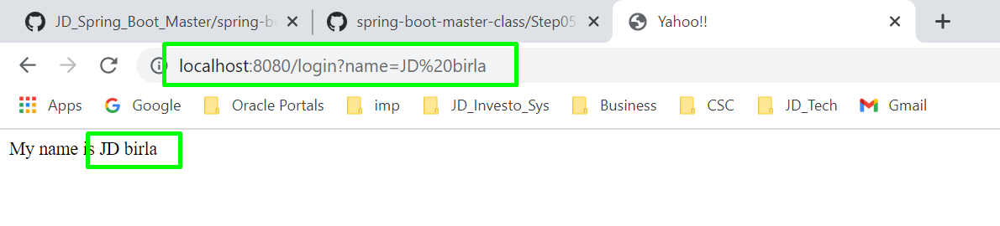

---

## What You Will Learn during this Step 06:
- Understand importance of DispatcherServlet.

### Spring MVC Request Flow
- DispatcherServlet receives HTTP Request.
- DispatcherServlet identifies the right Controller based on the URL.
- Controller executes Business Logic.
- Controller returns a) Model b) View Name Back to DispatcherServlet.
- DispatcherServlet identifies the correct view (ViewResolver).
- DispatcherServlet makes the model available to view and executes it.
- DispatcherServlet returns HTTP Response Back.

### MVC Flow

---
## What You Will Learn during this Step 07:
- Lets get the name from the user in a form
- use get and post method
- submit user data from post method and display

### Useful Snippets and References
```java
@Controller
public class LoginController {
	
	@RequestMapping(value="/login", method = RequestMethod.GET)
	public String showLoginPage(ModelMap model){
		return "login";
	}

	@RequestMapping(value="/login", method = RequestMethod.POST)
	public String showWelcomePage(ModelMap model, @RequestParam String name){
		model.put("name", name);
		return "welcome";
	}
	
}
```
* login.jsp
```jsp
<html>
<head>
<title>Yahoo!!</title>
</head>

<body>
	<form method="Post">
		Name : <input type="text" name="name" />
		Password : <input type="password" name="password" /> 
		<input type="submit" />
	</form>
</body>
</html>
```
* Welcome.jsp
```jsp 
<html>
<head>
<title>Yahoo!!</title>
</head>

<body>
	Welcome ${name}!!
</body>
</html>
```
### Form submit
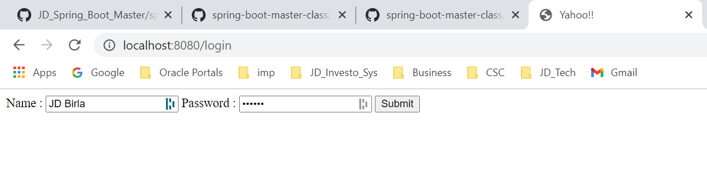
### Welcome page
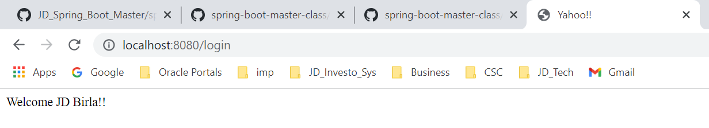
---
## What You Will Learn during this Step 08:
- Add validation for userid and password
- Hard coded validation!!

### todo.txt

```
Component, Service, Repository, Controller
Autowired
ComponentScan
Spring Boot Starter Parent
Spring Boot Starter Web
@SpringBootApplication
Auto Configuration
Dispatcher Servlet
/login => "login"
"login" => src/main/webapp/WEB-INF/jsp/login.jsp 
Search for a view named "login"
/login => LoginController 
```

### Useful Snippets and References
First Snippet

* LoginController
```java
@RequestMapping(value="/login", method = RequestMethod.POST)
	public String showWelcomePage(ModelMap model, @RequestParam String name , @RequestParam String password){
		
		boolean isValidUser = loginService.isValidUser(name, password);
		
		if(!isValidUser)
		{
			model.put("errorMessage", "Invalid Credentials !!!");
			return "login";
		}
		
		model.put("name", name);
		model.put("password", password);
		return "welcome";
	}
```
* login.jsp
```jsp
<font color="red">${errorMessage}</font>
```
* LoginService
```java
@Component
public class LoginService {
	
	public boolean isValidUser(String userName,String password )
	{
		boolean flag = false;

		if (userName.equalsIgnoreCase("JD") && password.equalsIgnoreCase("Jitu"))
			flag = true;

		return flag;
	}

}
```
### Output
#### Error page
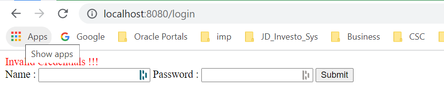
#### Success page
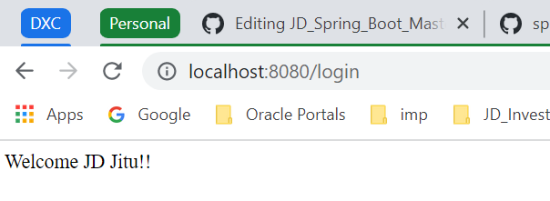
---
## What You Will Learn during this Step 09:
- Magic of Spring
 - Learn about Spring Auto-wiring and Dependency Management.
 - @Autowired, @Component
---
## What You Will Learn during this Step 10:

### What we will do:
- Create TodoController 
- Create Todo Pojo
- Create list-todos.jsp
- Make TodoService a @Service and inject it
- Changes in welcome.jsp 

### Snippets

Snippet -  com.jd.springboot.web.model.Todo
```java
public class Todo {
    private int id;
    private String user;
    private String desc;
    private Date targetDate;
    private boolean isDone;

```
* /spring-boot-first-web-application/src/main/java/com/jd/springboot/web/controller/TodoController.java
```Java 
@Controller
public class TodoController {
	
	@Autowired
	TodoService todoService;
	
	@RequestMapping(value="/list-todos", method = RequestMethod.GET)
	public String showLoginPage(ModelMap model){
		model.put("todos",todoService.retrieveTodos("in28Minutes"));
		return "list-todos";
	}
}
```
* com.jd.springboot.web.service.TodoService (In memory data base)
```java 
@Service
public class TodoService {
    private static List<Todo> todos = new ArrayList<Todo>();
    private static int todoCount = 3;

    static {
        todos.add(new Todo(1, "in28Minutes", "Learn Spring MVC", new Date(),
                false));
        todos.add(new Todo(2, "in28Minutes", "Learn Struts", new Date(), false));
        todos.add(new Todo(3, "in28Minutes", "Learn Hibernate", new Date(),
                false));
    }

    public List<Todo> retrieveTodos(String user) {
        List<Todo> filteredTodos = new ArrayList<Todo>();
        for (Todo todo : todos) {
            if (todo.getUser().equals(user)) {
                filteredTodos.add(todo);
            }
        }
        return filteredTodos;
    }

    public void addTodo(String name, String desc, Date targetDate,
            boolean isDone) {
        todos.add(new Todo(++todoCount, name, desc, targetDate, isDone));
    }

    public void deleteTodo(int id) {
        Iterator<Todo> iterator = todos.iterator();
        while (iterator.hasNext()) {
            Todo todo = iterator.next();
            if (todo.getId() == id) {
                iterator.remove();
            }
        }
    }
}
```
* welcome.jsp
```welcome.jsp
<html>
<head>
<title>Yahoo!!</title>
</head>

<body>
	Welcome ${name}!!  <a href="/list-todos">Click Here</a> for your To dos.
</body>
</html>
```
* list-todos.jsp
```list-todos.jsp
<html>
<head>
<title>Yahoo!!</title>
</head>

<body>
	Welcome ${name} for your to do ${todos}
</body>
</html>
```
---
## What You Will Learn during this Step 11:

### What we will do:
- Lets discuss about Architecture of web applications

* High level Architecture


* Web side options 
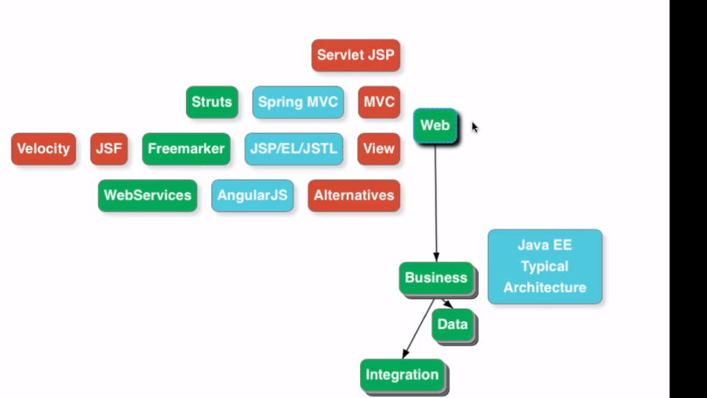

* Spring Architecture 
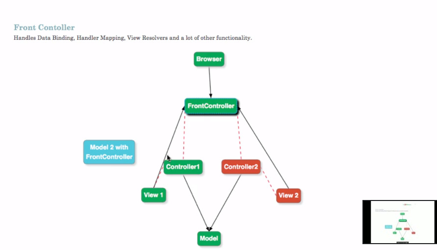

---
## What You Will Learn during this Step 12:
- Session vs Model vs Request.
- Be cautious about what you use Session for.
- @SessionAttributes("name") and how it works?
- Why use Model? "adding elements directly to the HttpServletRequest (as request attributes) would seem to serve the same purpose. The reason to do this is obvious when taking a look at one of the requirements we have set for the MVC framework: It should be as view-agnostic as possible, which means we’d like to be able to incorporate view technologies not bound to the HttpServletRequest as well." - Rod Johnson et. al’s book Professional Java Development with the Spring Framework
- Spring documentation states that the @SessionAttributes annotation “list the names of model attributes which should be transparently stored in the session or some conversational storage.”

## Useful Snippets and References

* com.jd.springboot.web.controller.TodoController
```Java
@Controller
@SessionAttributes("name")
public class TodoController {
	
	@Autowired
	TodoService todoService;
	
	@RequestMapping(value="/list-todos", method = RequestMethod.GET)
	public String showLoginPage(ModelMap model){
		String name = (String) model.get("name");
		model.put("todos", todoService.retrieveTodos(name));
		return "list-todos";
	}
	}
```
---
## What You Will Learn during this Step 13:
- Add Facility to add New Todo
- todo.jsp
- Importance of redirect:/list-todos

Snippet

*com.jd.springboot.web.controller.TodoController
```Java
@Controller
@SessionAttributes("name")
public class TodoController {
	
	@Autowired
	TodoService todoService;
	
	@RequestMapping(value="/list-todos", method = RequestMethod.GET)
	public String showLoginPage(ModelMap model){
		String name = (String) model.get("name");
		model.put("todos", todoService.retrieveTodos(name));
		return "list-todos";
	}
	
	@RequestMapping(value="/add-todo", method = RequestMethod.GET)
	public String showAddTodoPage(ModelMap model){
		return "todo";
	}

	@RequestMapping(value="/add-todo", method = RequestMethod.POST)
	public String addTodo(ModelMap model, @RequestParam String desc){
		todoService.addTodo((String) model.get("name"), desc, new Date(), false);
		return "redirect:/list-todos";
	}
```
* todo.jsp
```
<html>

<head>
<title>First Web Application</title>
</head>

<body>
ADD Todo Page for ${name}

<form method="post">
	Description : <input name="desc" type="text"/> 
	<input type="submit"/>	
</form>

</body>

</html>
```
*  list-todos.jsp

```
<html>
<head>
<title>Yahoo!!</title>
</head>
<body>
	Welcome ${name} for your to do ${todos}
	
	<BR/>
	<h1> Your Name is : ${name} </h1>
	<BR/>
	<a href="/add-todo">Add a Todo</a> 
</body>
</html>
```
---
## What You Will Learn during this Step 14:
- Display Todos in a table using JSTL Tags
- <%@ taglib uri="http://java.sun.com/jsp/jstl/core" prefix="c"%>
- Add Dependency for jstl

### Snippet for jsp tag lib like <c:forEach>
```       
       <dependency>
            <groupId>javax.servlet</groupId>
            <artifactId>jstl</artifactId>
        </dependency>
```
* list-todos
```JSP
<table class="table table-striped">
			<caption>Your todos are</caption>
			<thead>
				<tr>
					<th>Description</th>
					<th>Target Date</th>
					<th>Is it Done?</th>
				</tr>
			</thead>
			<tbody>
				<c:forEach items="${todos}" var="todo">
					<tr>
						<td>${todo.desc}</td>
						<td>${todo.targetDate}</td>
						<td>${todo.done}</td>
					</tr>
				</c:forEach>
			</tbody>
		</table>
```
---
## What You Will Learn during this Step 15:

### What we will do:
- Add bootstrap to give basic formatting to the page : We use bootstrap classes container,table and table-striped.
- We will use webjars
- Already auto configured by Spring Boot : o.s.w.s.handler.SimpleUrlHandlerMapping  : Mapped URL path [/webjars/**] onto handler of type [class org.springframework.web.servlet.resource.ResourceHttpRequestHandler]

### Useful Snippets

* POM.xml
```pom  
        <dependency>
            <groupId>org.webjars</groupId>
            <artifactId>bootstrap</artifactId>
            <version>3.3.6</version>
        </dependency>
        <dependency>
            <groupId>org.webjars</groupId>
            <artifactId>jquery</artifactId>
            <version>1.9.1</version>
        </dependency>
```

* list-todos.jsp
```
<%@ taglib uri="http://java.sun.com/jsp/jstl/core" prefix="c"%>

<html>

<head>
<title>Todo's for ${name}</title>
<link href="webjars/bootstrap/3.3.6/css/bootstrap.min.css"
	rel="stylesheet">
</head>

<body>
	<div class="container">
		<table class="table table-striped">
			<caption>Your todos are</caption>
			<thead>
				<tr>
					<th>Description</th>
					<th>Target Date</th>
					<th>Is it Done?</th>
				</tr>
			</thead>
			<tbody>
				<c:forEach items="${todos}" var="todo">
					<tr>
						<td>${todo.desc}</td>
						<td>${todo.targetDate}</td>
						<td>${todo.done}</td>
					</tr>
				</c:forEach>
			</tbody>
		</table>
		<div> <a class="button" href="/add-todo">Add a Todo</a></div>

		<script src="webjars/jquery/1.9.1/jquery.min.js"></script>
		<script src="webjars/bootstrap/3.3.6/js/bootstrap.min.js"></script>
	</div>
</body>

</html>
```
---
## What You Will Learn during this Step 16:

### What we will do:
- Add functionality to delete a todo
- Using bootstrap CSS classes 

## Useful Snippets

* com.jd.springboot.web.controller.TodoController
```Java    
	@RequestMapping(value="/delete-todo", method = RequestMethod.GET)
	public String deleteTodo(@RequestParam int id){
		todoService.deleteTodo(id);
		return "redirect:/list-todos";
	}
```
* Adding a delete button in list-todos.jsp
```html
<td><a type="button" class="btn btn-danger"
							href="/delete-todo?id=${todo.id}">Delete</a></td>

```
---
## What You Will Learn during this Step 17:

### What we will do:
In this short step:
- Format Add Todo.jso with bootstrap
- Add Html5 Form Validations

## Useful Snippets

* todo.jsp add some bootstrap and html5 tags
```    
<html>

<head>
<title>First Web Application</title>
<link href="webjars/bootstrap/3.3.6/css/bootstrap.min.css"
	rel="stylesheet">
</head>

<body>
<h2>Add your Description</h2> 
	<div class="container">
		<form method="post">
			<fieldset class="form-group">
				<label>Description</label> <input name="desc" type="text"
					class="form-control" required="required" />
			</fieldset>

			<button type="submit" class="btn btn-success">Add</button>
		</form>
		<div>
			<script src="webjars/jquery/1.9.1/jquery.min.js"></script>
			<script src="webjars/bootstrap/3.3.6/js/bootstrap.min.js"></script>
</body>

</html>
```
---
## What You Will Learn during this Step 18:

## What we will do:
- Lets use a modelAttribute for Todo
- Add Validations
- The JSR 303 and JSR 349 defines specification for the Bean Validation API (version 1.0 and 1.1, respectively), and Hibernate Validator is the reference implementation.
- org.hibernate:hibernate-validator

### todo.txt

```
Implementing Server Side Validation
~~~~~~~~~~~~~~~~~~~~~~~~~~~~~~~~~~~
Command Bean/modelAttribute or Form Backing Bean 
Add Validation
Use Validation on Controller
Display Errors in View
Command Bean
~~~~~~~~~~~~
Controller
View - Spring Form Tags
LoginController -> adds name to model
welcome.jsp -> shows ${name}
TodoController -> redirects to list-todos.jsp
${name} is empty 
Component, Service, Repository, Controller
Autowired
ComponentScan
```
## Useful Snippets
* Pom.xml
```Add dependency 
	<dependency>
			<groupId>org.springframework.boot</groupId>
			<artifactId>spring-boot-starter-validation</artifactId>
		</dependency>
```	
* com.jd.springboot.web.controller.TodoController	
```java
@RequestMapping(value="/add-todo", method = RequestMethod.GET)
	public String showAddTodoPage(ModelMap model){
		model.addAttribute("todo", new Todo(0, (String) model.get("name"), " ",
				new Date(), false));
		return "todo";
	}

	@RequestMapping(value="/add-todo", method = RequestMethod.POST)
	public String addTodo(ModelMap model,  @Valid Todo todo , BindingResult result){
		if(result.hasErrors()){
			return "todo";	
		}
		todoService.addTodo((String) model.get("name"), todo.getDesc(), new Date(), false);
		return "redirect:/list-todos";
	}
```
* com.jd.springboot.web.model.Todo @Size(min=15, message="Enter at least 15 Characters...")

```java
 private int id;
    private String user;
    @Size(min=15, message="Enter at least 15 Characters...")
    private String desc;
    private Date targetDate;
    private boolean isDone;
```	
* todo.jsp  Added spring tag lib and used form elements
```
<%@taglib uri="http://www.springframework.org/tags/form" prefix="form"%>
<html>

<head>
<title>First Web Application</title>
<link href="webjars/bootstrap/3.3.6/css/bootstrap.min.css"
	rel="stylesheet">
</head>

<body>
<h2>Add your Description</h2> 
	<div class="container">
		<form:form method="post" modelAttribute="todo">
			<fieldset class="form-group">
				<form:label path="desc">Description</form:label> 
				<form:input path="desc" type="text"
					class="form-control" required="required"/>
				<form:errors path="desc" cssClass="text-warning"/>
			</fieldset>

			<button type="submit" class="btn btn-success">Add</button>
		</form:form>
		<div>
			<script src="webjars/jquery/1.9.1/jquery.min.js"></script>
			<script src="webjars/bootstrap/3.3.6/js/bootstrap.min.js"></script>
</body>

</html>
```
---
## What You Will Learn during this Step 19:

### What we will do:
- Add Update Functionality
- Lets Use the Same JSP TODO.jsp as earlier.

### todo.txt

```
Implementing Server Side Validation
~~~~~~~~~~~~~~~~~~~~~~~~~~~~~~~~~~~
Command Bean or Form Backing Bean
Add Validation
Use Validation on Controller
Display Errors in View
Command Bean
~~~~~~~~~~~~
Controller
View - Spring Form Tags
LoginController -> adds name to model
welcome.jsp -> shows ${name}
TodoController -> redirects to list-todos.jsp
${name} is empty 
```
* list-todos.jsp add update botton
```
<td><a type="button" class="btn btn-success"
							href="/update-todo?id=${todo.id}">Update</a></td>
```
* com.jd.springboot.web.controller.TodoController  add two methods

```java
@RequestMapping(value = "/update-todo", method = RequestMethod.GET)
	public String showUpdateTodoPage(@RequestParam int id, ModelMap model) {
		Todo todo = todoService.retrieveTodo(id);
		model.put("todo", todo);
		return "todo";
	}

	@RequestMapping(value = "/update-todo", method = RequestMethod.POST)
	public String updateTodo(ModelMap model, @Valid Todo todo, BindingResult result) {

		if (result.hasErrors()) {
			return "todo";
		}
		
		todo.setUser((String) model.get("name"));
		
		todoService.updateTodo(todo);

		return "redirect:/list-todos";
	}
```
* com.jd.springboot.web.service.TodoService added two methods
```
	public Todo retrieveTodo(int id) {
		for (Todo todo : todos) {
			if (todo.getId() == id) {
				return todo;
			}
		}
		return null;
	}

	public void updateTodo(Todo todo) {
		todos.remove(todo);
		todos.add(todo);
	}
```
---
## What You Will Learn during this Step 20:

### What we will do:
- Make real use of the Target Date Field
- initBinder method into todocontroller

Code snipt

* adding date picker dependency 
```pom.xml 
<dependency>
			<groupId>org.webjars</groupId>
			<artifactId>bootstrap-datepicker</artifactId>
			<version>1.0.1</version>
		</dependency>
```
* com.jd.springboot.web.controller.TodoController adding InitBinder for date formate same across application
```
@Controller
@SessionAttributes("name")
public class TodoController {
	
	@Autowired
	TodoService todoService;
	
	@InitBinder
	public void initBinder(WebDataBinder binder) {
		// Date - dd/MM/yyyy
		SimpleDateFormat dateFormat = new SimpleDateFormat("dd/MM/yyyy");
		binder.registerCustomEditor(Date.class, new CustomDateEditor(
				dateFormat, false));
	}
```
* list-todos.jsp adding jstl formate tag lib
```
<%@ taglib uri="http://java.sun.com/jsp/jstl/fmt" prefix="fmt"%>

<td><fmt:formatDate value="${todo.targetDate}" pattern="dd/MM/yyyy"/></td>
```
* todo.jsp adding new field targetDate and datepicker
```
<%@taglib uri="http://www.springframework.org/tags/form" prefix="form"%>
<html>

<head>
<title>First Web Application</title>
<link href="webjars/bootstrap/3.3.6/css/bootstrap.min.css"
	rel="stylesheet">
</head>


<body>
	<h2>Add your Description</h2>
	<div class="container">
		<form:form method="post" modelAttribute="todo">
			<form:hidden path="id" />
			<fieldset class="form-group">
				<form:label path="desc">Description</form:label>
				<form:input path="desc" type="text" class="form-control"
					required="required" />
				<form:errors path="desc" cssClass="text-warning" />
			</fieldset>

			<fieldset class="form-group">
				<form:label path="targetDate">Target Date</form:label>
				<form:input path="targetDate" type="text" class="form-control"
					required="required" />
				<form:errors path="targetDate" cssClass="text-warning" />
			</fieldset>

			<button type="submit" class="btn btn-success">Add/Update</button>
		</form:form>
		<div>
			<script src="webjars/jquery/1.9.1/jquery.min.js"></script>
			<script src="webjars/bootstrap/3.3.6/js/bootstrap.min.js"></script>
			<script src="webjars/jquery/1.9.1/jquery.min.js"></script>
			<script src="webjars/bootstrap/3.3.6/js/bootstrap.min.js"></script>
			<script
				src="webjars/bootstrap-datepicker/1.0.1/js/bootstrap-datepicker.js"></script>
			<script>
				$('#targetDate').datepicker({
					format : 'dd/mm/yyyy'
				});
			</script>
</body>

</html>
```
---
## What You Will Learn during this Step 21:

### What we will do:
- Add a navigation bar
- Use JSP Fragments header,footer and navigation
- Create folder under src/main/webapp/WEB-INF/jsp/common and three files footer.jspf,header.jspf,navigation.jspf
### Useful Snippets
* src/main/webapp/WEB-INF/jsp/common/footer.jspf

```
<script src="webjars/jquery/1.9.1/jquery.min.js"></script>
<script src="webjars/bootstrap/3.3.6/js/bootstrap.min.js"></script>
<script
	src="webjars/bootstrap-datepicker/1.0.1/js/bootstrap-datepicker.js"></script>
<script>
	$('#targetDate').datepicker({
		format : 'dd/mm/yyyy'
	});
</script>
</body>
</html>
```
* src/main/webapp/WEB-INF/jsp/common/header.jspf

```
<%@ taglib uri="http://java.sun.com/jsp/jstl/core" prefix="c"%>
<%@ taglib uri="http://java.sun.com/jsp/jstl/fmt" prefix="fmt"%>
<%@taglib uri="http://www.springframework.org/tags/form" prefix="form"%>
<html>
<head>
<title>First Web Application</title>
<link href="webjars/bootstrap/3.3.6/css/bootstrap.min.css"
	rel="stylesheet">
</head>
<body>
```
* src/main/webapp/WEB-INF/jsp/common/navigation.jspf

```
	<nav role="navigation" class="navbar navbar-default">
	    <div class="">
	        <a href="http://www.in28minutes.com" class="navbar-brand">in28Minutes</a>
	    </div>
	    <div class="navbar-collapse">
	        <ul class="nav navbar-nav">
	            <li class="active"><a href="/login">Home</a></li>
	            <li><a href="/list-todos">Todos</a></li>
	        </ul>
	    </div>
	</nav>
```
* list-todos.jsp
```
<%@ include file="common/header.jspf" %>
<%@ include file="common/navigation.jspf" %>
	<div class="container">
		<table class="table table-striped">
			<caption>Your todos are</caption>
			<thead>
				<tr>
					<th>Description</th>
					<th>Target Date</th>
					<th>Is it Done?</th>
					<th>Update</th>
					<th>Delete</th>
				</tr>
			</thead>
			<tbody>
				<c:forEach items="${todos}" var="todo">
					<tr>
						<td>${todo.desc}</td>
						<td><fmt:formatDate value="${todo.targetDate}" pattern="dd/MM/yyyy"/></td>
						<td>${todo.done}</td>
						<td><a type="button" class="btn btn-success"
							href="/update-todo?id=${todo.id}">Update</a></td>
						<td><a type="button" class="btn btn-danger"
							href="/delete-todo?id=${todo.id}">Delete</a></td>

					</tr> 	
				</c:forEach>
			</tbody>
		</table>
		<div>
			<a class="button" href="/add-todo">Add a Todo</a>
		</div>

		
	</div>
<%@ include file="common/footer.jspf" %>
```
* login.jsp
```
<%@ include file="common/header.jspf" %>
<%@ include file="common/navigation.jspf" %>

<div class="container">
<font color="red">${errorMessage}</font>
	<form method="Post">
		Name : <input type="text" name="name" />
		Password : <input type="password" name="password" /> 
		<input type="submit" />
	</form>
</div>
<%@ include file="common/footer.jspf" %>
```
*todo.jsp
```
<%@ include file="common/header.jspf" %>
<%@ include file="common/navigation.jspf" %>
	<div class="container">
		<form:form method="post" modelAttribute="todo">
			<form:hidden path="id" />
			<fieldset class="form-group">
				<form:label path="desc">Description</form:label>
				<form:input path="desc" type="text" class="form-control"
					required="required" />
				<form:errors path="desc" cssClass="text-warning" />
			</fieldset>

			<fieldset class="form-group">
				<form:label path="targetDate">Target Date</form:label>
				<form:input path="targetDate" type="text" class="form-control"
					required="required" />
				<form:errors path="targetDate" cssClass="text-warning" />
			</fieldset>

			<button type="submit" class="btn btn-success">Add/Update</button>
		</form:form>
		<div>
			</div>
<%@ include file="common/footer.jspf" %>
```
* welcome.jsp
```
<%@ include file="common/header.jspf"%>
<%@ include file="common/navigation.jspf"%>
<div class="container">
	Welcome ${name}!!  <a href="/list-todos">Click Here</a> for your To dos.
</div>
<%@ include file="common/footer.jspf"%>
```
---
## What You Will Learn during this Step 22:

## What we will do:
- Prepare for Using Spring Security
- Remove All the Login Related Functionality
- Make Welcome the default page - with some hardcoding to start with.
- Refactor getLoggedInUserName
- Update Home Page Link in navigation

Code Snippet

*com.jd.springboot.web.controller.LoginController put / for any URL redirect to welcome page
```
@Controller
@SessionAttributes("name")
public class LoginController {
	
	@Autowired
	LoginService loginService;
	
	@RequestMapping(value="/", method = RequestMethod.GET)
	public String showLoginPage(ModelMap model){
		model.put("name", "JD");
		return "welcome";
	}
	
}
```
*com.jd.springboot.web.controller.TodoController remove repeated code and call private method

```
private String getLoggedInUserName(ModelMap model) {
		return (String) model.get("name");
	}
```
* navigation.jspf
```
 <li class="active"><a href="/">Home</a></li>
```
---
## What You Will Learn during this Step 23:

### What we will do:
- Get Setup for Spring Security

### Useful Snippets

* Pom.xml add dependency
```
 <dependency>
            <groupId>org.springframework.boot</groupId>
            <artifactId>spring-boot-starter-security</artifactId>
        </dependency>

```
*com.jd.springboot.web.security.SecurityConfiguration
```java
package com.jd.springboot.web.security;

import org.springframework.beans.factory.annotation.Autowired;
import org.springframework.context.annotation.Bean;
import org.springframework.security.config.annotation.authentication.builders.AuthenticationManagerBuilder;
import org.springframework.security.config.annotation.web.builders.HttpSecurity;
import org.springframework.security.config.annotation.web.configuration.EnableWebSecurity;
import org.springframework.security.config.annotation.web.configuration.WebSecurityConfigurerAdapter;
import org.springframework.security.crypto.bcrypt.BCryptPasswordEncoder;
import org.springframework.security.crypto.password.PasswordEncoder;

@EnableWebSecurity
public class SecurityConfiguration extends WebSecurityConfigurerAdapter{
	//Create User - in28Minutes/dummy
	@Autowired
    public void configureGlobalSecurity(AuthenticationManagerBuilder auth)
            throws Exception {
		auth.inMemoryAuthentication()
	    .passwordEncoder(passwordEncoder)
	    .withUser("JD").password(passwordEncoder.encode("Jitu")).roles("USER")
	    .and()
	    .withUser("admin").password(passwordEncoder.encode("123456")).roles("USER", "ADMIN");
	  }
	@Autowired
	  PasswordEncoder passwordEncoder;
	
	@Bean
	  public PasswordEncoder passwordEncoder() {
	    return new BCryptPasswordEncoder();
	  }
	 
	
	@Override
    protected void configure(HttpSecurity http) throws Exception {
        http.authorizeRequests().antMatchers("/login").permitAll()
                .antMatchers("/", "/*todo*/**").access("hasRole('USER')").and()
                .formLogin();
    }
}
```
---
## What You Will Learn during this Step 24 and 25:

### What we will do 24:
- Remove Hardcoding of User Name
- Remove LoginService
- Rename LoginController to WelcomeController
- Add Logout Functionality
## What we will do 25:
- Basic Exception Handling
- Exception Handling is a cross cutting concern
- Do not handle exceptions in Controllers or Services, if you cannot add value to them.
- Bit of refactoring on the controllers
- Whitelabel Error Page provided by default by Spring Boot
 - You can see a few details of the errors
- We can customize if we would want to
- @ControllerAdvice and Controller Specific Exception Handling
- Handling Errors thrown from Views

### Useful Snippets 

*com.jd.springboot.web.controller.ErrorController

```java
package com.jd.springboot.web.controller;

import javax.servlet.http.HttpServletRequest;

import org.springframework.stereotype.Controller;
import org.springframework.web.bind.annotation.ExceptionHandler;
import org.springframework.web.servlet.ModelAndView;

@Controller("error")
public class ErrorController {
	
	@ExceptionHandler(Exception.class)
	public ModelAndView handleException
		(HttpServletRequest request, Exception ex){
		ModelAndView mv = new ModelAndView();

		mv.addObject("exception", ex.getLocalizedMessage());
		mv.addObject("url", request.getRequestURL());
		
		mv.setViewName("error");
		return mv;
	}

}
```

*com.jd.springboot.web.controller.LogoutController

```
package com.jd.springboot.web.controller;

import javax.servlet.http.HttpServletRequest;
import javax.servlet.http.HttpServletResponse;

import org.springframework.security.core.Authentication;
import org.springframework.security.core.context.SecurityContextHolder;
import org.springframework.security.web.authentication.logout.SecurityContextLogoutHandler;
import org.springframework.stereotype.Controller;
import org.springframework.web.bind.annotation.RequestMapping;
import org.springframework.web.bind.annotation.RequestMethod;

@Controller
public class LogoutController {
	
	
	@RequestMapping(value="/logout", method = RequestMethod.GET)
	public String showWelcomPage(HttpServletRequest req , HttpServletResponse res){
		Authentication authentication = SecurityContextHolder.getContext().getAuthentication();
		if(authentication != null)
		{
			new SecurityContextLogoutHandler().logout(req, res, authentication);
		}
		return "redirect:/";
	}
	
}

```

*com.jd.springboot.web.controller.WelcomeController  changing from loginController to WelcomeController

```
package com.jd.springboot.web.controller;

import org.springframework.security.core.context.SecurityContextHolder;
import org.springframework.security.core.userdetails.UserDetails;
import org.springframework.stereotype.Controller;
import org.springframework.ui.ModelMap;
import org.springframework.web.bind.annotation.RequestMapping;
import org.springframework.web.bind.annotation.RequestMethod;

@Controller
public class WelcomeController {
	
	
	@RequestMapping(value="/", method = RequestMethod.GET)
	public String showWelcomPage(ModelMap model){
		model.put("name", getLoggedinUserName());
		return "welcome";
	}
	private String getLoggedinUserName()
	{
		Object principal = SecurityContextHolder.getContext().getAuthentication().getPrincipal();
		if(principal instanceof UserDetails)
		{
			return ((UserDetails) principal).getUsername();
		}
		return principal.toString();
	}
	
}

```

*com.jd.springboot.web.security.SecurityConfiguration  for spring security

```
package com.jd.springboot.web.security;

import org.springframework.beans.factory.annotation.Autowired;
import org.springframework.context.annotation.Bean;
import org.springframework.security.config.annotation.authentication.builders.AuthenticationManagerBuilder;
import org.springframework.security.config.annotation.web.builders.HttpSecurity;
import org.springframework.security.config.annotation.web.configuration.EnableWebSecurity;
import org.springframework.security.config.annotation.web.configuration.WebSecurityConfigurerAdapter;
import org.springframework.security.crypto.bcrypt.BCryptPasswordEncoder;
import org.springframework.security.crypto.password.PasswordEncoder;

@EnableWebSecurity
public class SecurityConfiguration extends WebSecurityConfigurerAdapter{
	//Create User - in28Minutes/dummy
	@Autowired
    public void configureGlobalSecurity(AuthenticationManagerBuilder auth)
            throws Exception {
		auth.inMemoryAuthentication()
	    .passwordEncoder(passwordEncoder)
	    .withUser("JD").password(passwordEncoder.encode("Jitu")).roles("USER")
	    .and()
	    .withUser("admin").password(passwordEncoder.encode("123456")).roles("USER", "ADMIN");
	  }
	@Autowired
	  PasswordEncoder passwordEncoder;
	
	@Bean
	  public PasswordEncoder passwordEncoder() {
	    return new BCryptPasswordEncoder();
	  }
	 
	
	@Override
    protected void configure(HttpSecurity http) throws Exception {
        http.authorizeRequests().antMatchers("/login").permitAll()
                .antMatchers("/", "/*todo*/**").access("hasRole('USER')").and()
                .formLogin();
    }
}
```

*navigation.jspf
```
<nav role="navigation" class="navbar navbar-default">
	    <div class="">
	        <a href="https://github.com/jdbirla/JD_Spring_Boot_Master" class="navbar-brand">JD_Repo</a>
	    </div>
	    <div class="navbar-collapse">
	        <ul class="nav navbar-nav">
	            <li class="active"><a href="/">Home</a></li>
	            <li><a href="/list-todos">Todos</a></li>
	        </ul>
	        
	        <ul class="nav navbar-nav navbar-right">
	            <li><a href="/logout">Logout</a></li>
	        </ul>
	        
	    </div>
	</nav>
```

*error.jsp
```
<%@ include file="common/header.jspf"%>
<%@ include file="common/navigation.jspf"%>
<div class="container">
	Sorry  ${name}!! We have some issues ,please contact GOD.
</div>
<%@ include file="common/footer.jspf"%>
```
*com.jd.springboot.web.controller.LogoutController
```
@Controller
public class LogoutController {
	
	
	@RequestMapping(value="/logout", method = RequestMethod.GET)
	public String showWelcomPage(HttpServletRequest req , HttpServletResponse res){
		Authentication authentication = SecurityContextHolder.getContext().getAuthentication();
		if(authentication != null)
		{
			new SecurityContextLogoutHandler().logout(req, res, authentication);
		}
		return "redirect:/";
	}
	
}
```
### todo.txt
```
Implementing Server Side Validation
~~~~~~~~~~~~~~~~~~~~~~~~~~~~~~~~~~~
Command Bean or Form Backing Bean
Add Validation
Use Validation on Controller
Display Errors in View
Command Bean
~~~~~~~~~~~~
Controller
View - Spring Form Tags
LoginController -> adds name to model
welcome.jsp -> shows ${name}
TodoController -> redirects to list-todos.jsp
${name} is empty 
Component, Service, Repository, Controller
Autowired
ComponentScan
Field dummyService in com.in28minutes.springboot.web.controller.LoginController 
required a bean of type 'com.in28minutes.dummy.DummyService' 
that could not be found.
Spring Boot Starter Parent
Spring Boot Starter Web
@SpringBootApplication
Auto Configuration
Dispatcher Servlet
/login => "login"
"login" => src/main/webapp/WEB-INF/jsp/login.jsp 
Search for a view named "login"
/login => LoginController 
```
---
## Application running screens

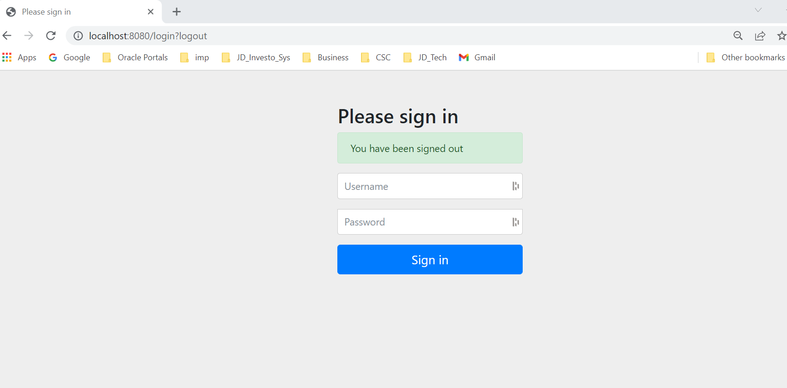

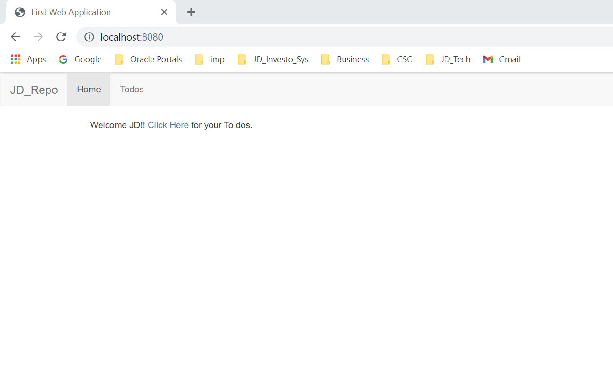

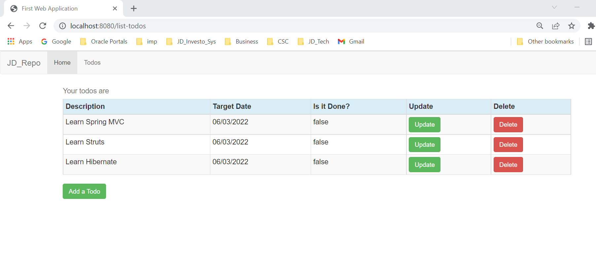

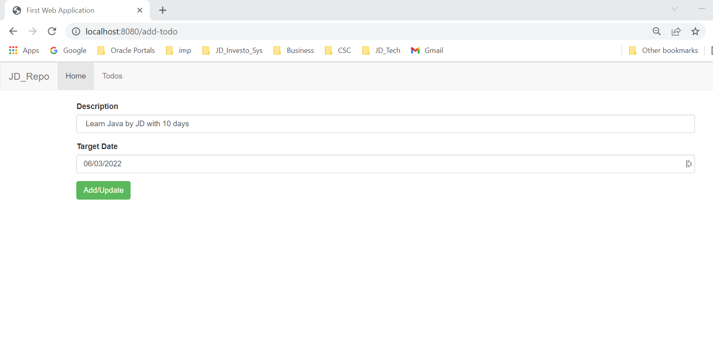

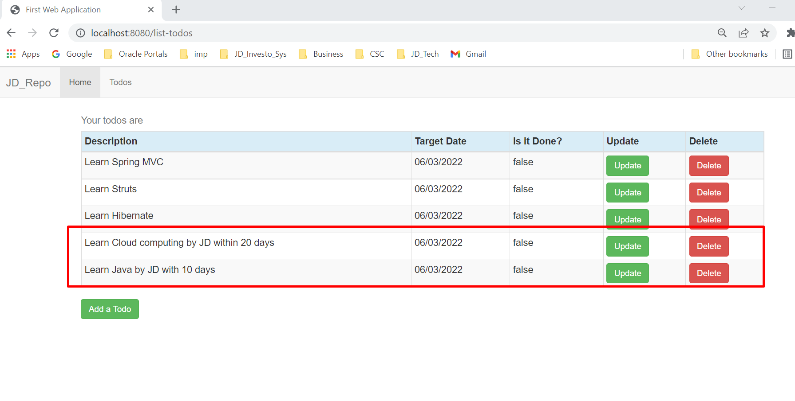

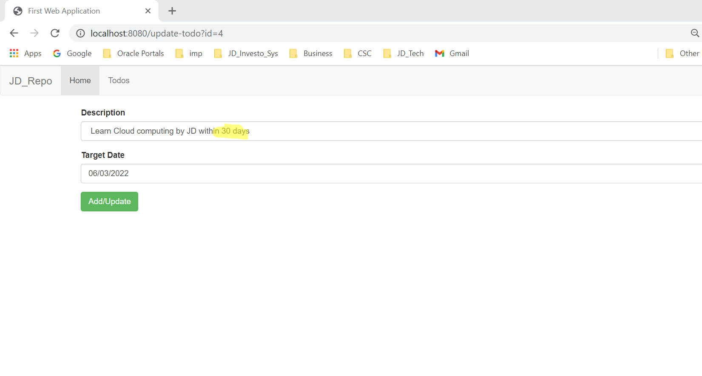

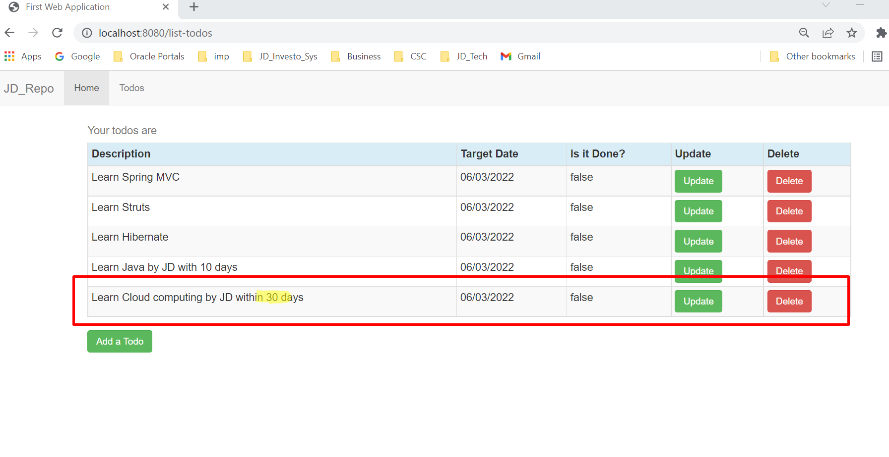

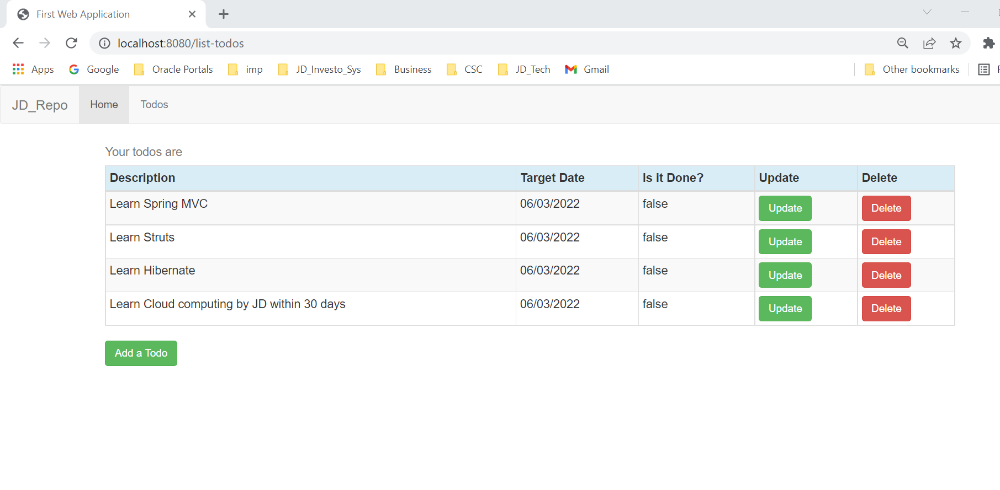

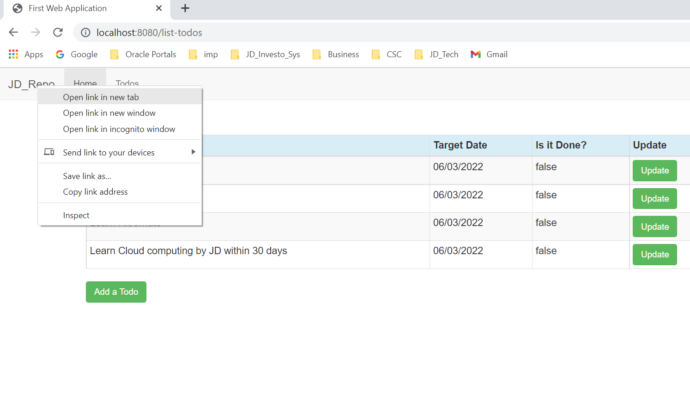

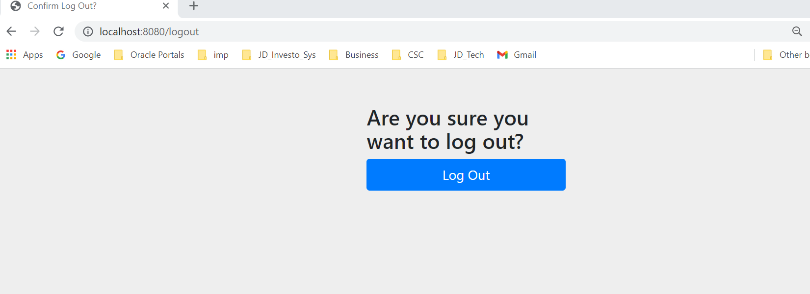

---