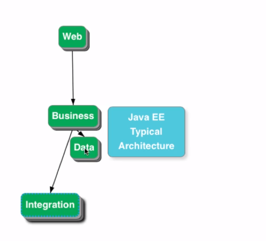

# Spring Boot Web Application Detail Level

## What You Will Learn during this Step 01:
- Lets create a simple web application using Spring Boot
- Lets run the Spring Boot Application
- There is a lot of magic happening in here! We will take a deep dive into the magic in Step 03. 

### Files List

1. /spring-boot-first-web-application/pom.xml
2. /spring-boot-first-web-application/src/main/java/com/jd/springboot/web/springbootfirstwebapplication/SpringBootFirstWebApplication.java
3. /spring-boot-first-web-application/src/main/resources/application.properties
4. /spring-boot-first-web-application/src/test/java/com/jd/springboot/web/springbootfirstwebapplication/SpringBootFirstWebApplicationTests.java

### todo.txt
```
Spring Boot Starter Parent
Spring Boot Starter Web
@SpringBootApplication
Auto Configuration
```
---
## What You Will Learn during this Step 02:
### todo.txt

```
Spring Boot Starter Parent
Spring Boot Starter Web
@SpringBootApplication
Auto Configuration
```
### Learning
- @RequestMapping(value = "/login", method = RequestMethod.GET)
- http://localhost:8080/login
- Why @ResponseBody?
- Important of RequestMapping method
- How do web applications work? Request and Response
 - Browser sends Http Request to Web Server
 - Code in Web Server => Input:HttpRequest, Output: HttpResponse
 - Web Server responds with Http Response

### Useful Snippets and References
First Snippet
```
@Controller
public class LoginController {
    @RequestMapping(value = "/login")
    @ResponseBody
    public String sayHello() {
        return "Hello World dummy";
    }
}
```
### src/main/resources/application.properties
```
logging.level.org.springframework.web: DEBUG
```
### Exercises
- Create another method with a different mapping returning some other text!
---
## What You Will Learn during this Step 03:
- Demystifying some of the magic
 - Spring Boot Starter Parent
 - Spring Boot Starter Web
 - Embedded Tomcat
 - Dev Tools

---

## What You Will Learn during this Step 04:
- Your First JSP
- There is a bit of setup before we get there!
- Introduction to View Resolver

## Exercises
- Create a new jsp and a new controller method to redirect to it!
- Play around!
### todo.txt
```
Spring Boot Starter Parent
Spring Boot Starter Web
@SpringBootApplication
Auto Configuration
Dispatcher Servlet
/login => "login"
"login" => src/main/webapp/WEB-INF/jsp/login.jsp 
Search for a view named "login"
/login => LoginController 
```

### Useful Snippets and References
First Snippet - /src/main/webapp/WEB-INF/jsp/login.jsp
```html
<html>
<head>
<title>Yahoo!!</title>
</head>
<body>
My First JSP!!!
</body>
</html>
```
Second Snippet - /src/main/resources/application.properties
```properties
spring.mvc.view.prefix: /WEB-INF/jsp/
spring.mvc.view.suffix: .jsp
logging.level.: DEBUG
```
Third Snippet : To enable jsp support in embedded tomcat server!
```xml
        <dependency>
            <groupId>org.apache.tomcat.embed</groupId>
            <artifactId>tomcat-embed-jasper</artifactId>
            <scope>provided</scope>
        </dependency>

```

Fourth Snippet : To enable jsp support in embedded tomcat server!
```java

@Controller
public class LoginController {
	
	@RequestMapping(value = "/login")
	public String sayHello()
	{
		return "login";
	}

}

```
---
## What You Will Learn during this Step 05:
- You first GET Parameter.
- Problem with using GET
- Introducing @RequestParam String name, ModelMap model

### Snippets
```java
@RequestMapping(value = "/login")
	public String sayHello(@RequestParam String name, ModelMap map )
	{
		map.put("parama1", name);
		return "login" ;
	}
```
```html
<html>
<head>
<title>Yahoo!!</title>
</head>
<body>
My name is ${parama1}
</body>
</html>
```
### Output from Browser


---

## What You Will Learn during this Step 06:
- Understand importance of DispatcherServlet.

### Spring MVC Request Flow
- DispatcherServlet receives HTTP Request.
- DispatcherServlet identifies the right Controller based on the URL.
- Controller executes Business Logic.
- Controller returns a) Model b) View Name Back to DispatcherServlet.
- DispatcherServlet identifies the correct view (ViewResolver).
- DispatcherServlet makes the model available to view and executes it.
- DispatcherServlet returns HTTP Response Back.

### MVC Flow

---
## What You Will Learn during this Step 07:
- Lets get the name from the user in a form
- use get and post method
- submit user data from post method and display

### Useful Snippets and References
```java
@Controller
public class LoginController {
	
	@RequestMapping(value="/login", method = RequestMethod.GET)
	public String showLoginPage(ModelMap model){
		return "login";
	}

	@RequestMapping(value="/login", method = RequestMethod.POST)
	public String showWelcomePage(ModelMap model, @RequestParam String name){
		model.put("name", name);
		return "welcome";
	}
	
}
```
* login.jsp
```jsp
<html>
<head>
<title>Yahoo!!</title>
</head>

<body>
	<form method="Post">
		Name : <input type="text" name="name" />
		Password : <input type="password" name="password" /> 
		<input type="submit" />
	</form>
</body>
</html>
```
* Welcome.jsp
```jsp 
<html>
<head>
<title>Yahoo!!</title>
</head>

<body>
	Welcome ${name}!!
</body>
</html>
```
### Form submit

### Welcome page

---
## What You Will Learn during this Step 08:
- Add validation for userid and password
- Hard coded validation!!

### todo.txt

```
Component, Service, Repository, Controller
Autowired
ComponentScan
Spring Boot Starter Parent
Spring Boot Starter Web
@SpringBootApplication
Auto Configuration
Dispatcher Servlet
/login => "login"
"login" => src/main/webapp/WEB-INF/jsp/login.jsp 
Search for a view named "login"
/login => LoginController 
```

### Useful Snippets and References
First Snippet

* LoginController
```java
@RequestMapping(value="/login", method = RequestMethod.POST)
	public String showWelcomePage(ModelMap model, @RequestParam String name , @RequestParam String password){
		
		boolean isValidUser = loginService.isValidUser(name, password);
		
		if(!isValidUser)
		{
			model.put("errorMessage", "Invalid Credentials !!!");
			return "login";
		}
		
		model.put("name", name);
		model.put("password", password);
		return "welcome";
	}
```
* login.jsp
```jsp
<font color="red">${errorMessage}</font>
```
* LoginService
```java
@Component
public class LoginService {
	
	public boolean isValidUser(String userName,String password )
	{
		boolean flag = false;

		if (userName.equalsIgnoreCase("JD") && password.equalsIgnoreCase("Jitu"))
			flag = true;

		return flag;
	}

}
```
### Output
#### Error page

#### Success page

---
## What You Will Learn during this Step 09:
- Magic of Spring
 - Learn about Spring Auto-wiring and Dependency Management.
 - @Autowired, @Component
---
## What You Will Learn during this Step 10:

### What we will do:
- Create TodoController 
- Create Todo Pojo
- Create list-todos.jsp
- Make TodoService a @Service and inject it
- Changes in welcome.jsp 

### Snippets

Snippet -  com.jd.springboot.web.model.Todo
```java
public class Todo {
    private int id;
    private String user;
    private String desc;
    private Date targetDate;
    private boolean isDone;

```
* /spring-boot-first-web-application/src/main/java/com/jd/springboot/web/controller/TodoController.java
```Java 
@Controller
public class TodoController {
	
	@Autowired
	TodoService todoService;
	
	@RequestMapping(value="/list-todos", method = RequestMethod.GET)
	public String showLoginPage(ModelMap model){
		model.put("todos",todoService.retrieveTodos("in28Minutes"));
		return "list-todos";
	}
}
```
* com.jd.springboot.web.service.TodoService (In memory data base)
```java 
@Service
public class TodoService {
    private static List<Todo> todos = new ArrayList<Todo>();
    private static int todoCount = 3;

    static {
        todos.add(new Todo(1, "in28Minutes", "Learn Spring MVC", new Date(),
                false));
        todos.add(new Todo(2, "in28Minutes", "Learn Struts", new Date(), false));
        todos.add(new Todo(3, "in28Minutes", "Learn Hibernate", new Date(),
                false));
    }

    public List<Todo> retrieveTodos(String user) {
        List<Todo> filteredTodos = new ArrayList<Todo>();
        for (Todo todo : todos) {
            if (todo.getUser().equals(user)) {
                filteredTodos.add(todo);
            }
        }
        return filteredTodos;
    }

    public void addTodo(String name, String desc, Date targetDate,
            boolean isDone) {
        todos.add(new Todo(++todoCount, name, desc, targetDate, isDone));
    }

    public void deleteTodo(int id) {
        Iterator<Todo> iterator = todos.iterator();
        while (iterator.hasNext()) {
            Todo todo = iterator.next();
            if (todo.getId() == id) {
                iterator.remove();
            }
        }
    }
}
```
* welcome.jsp
```welcome.jsp
<html>
<head>
<title>Yahoo!!</title>
</head>

<body>
	Welcome ${name}!!  <a href="/list-todos">Click Here</a> for your To dos.
</body>
</html>
```
* list-todos.jsp
```list-todos.jsp
<html>
<head>
<title>Yahoo!!</title>
</head>

<body>
	Welcome ${name} for your to do ${todos}
</body>
</html>
```
---
## What You Will Learn during this Step 11:

### What we will do:
- Lets discuss about Architecture of web applications

* High level Architecture


* Web side options 


* Spring Architecture 


---
## What You Will Learn during this Step 12:
- Session vs Model vs Request.
- Be cautious about what you use Session for.
- @SessionAttributes("name") and how it works?
- Why use Model? "adding elements directly to the HttpServletRequest (as request attributes) would seem to serve the same purpose. The reason to do this is obvious when taking a look at one of the requirements we have set for the MVC framework: It should be as view-agnostic as possible, which means we’d like to be able to incorporate view technologies not bound to the HttpServletRequest as well." - Rod Johnson et. al’s book Professional Java Development with the Spring Framework
- Spring documentation states that the @SessionAttributes annotation “list the names of model attributes which should be transparently stored in the session or some conversational storage.”

## Useful Snippets and References

* com.jd.springboot.web.controller.TodoController
```Java
@Controller
@SessionAttributes("name")
public class TodoController {
	
	@Autowired
	TodoService todoService;
	
	@RequestMapping(value="/list-todos", method = RequestMethod.GET)
	public String showLoginPage(ModelMap model){
		String name = (String) model.get("name");
		model.put("todos", todoService.retrieveTodos(name));
		return "list-todos";
	}
	}
```
---
## What You Will Learn during this Step 13:
- Add Facility to add New Todo
- todo.jsp
- Importance of redirect:/list-todos

Snippet

*com.jd.springboot.web.controller.TodoController
```Java
@Controller
@SessionAttributes("name")
public class TodoController {
	
	@Autowired
	TodoService todoService;
	
	@RequestMapping(value="/list-todos", method = RequestMethod.GET)
	public String showLoginPage(ModelMap model){
		String name = (String) model.get("name");
		model.put("todos", todoService.retrieveTodos(name));
		return "list-todos";
	}
	
	@RequestMapping(value="/add-todo", method = RequestMethod.GET)
	public String showAddTodoPage(ModelMap model){
		return "todo";
	}

	@RequestMapping(value="/add-todo", method = RequestMethod.POST)
	public String addTodo(ModelMap model, @RequestParam String desc){
		todoService.addTodo((String) model.get("name"), desc, new Date(), false);
		return "redirect:/list-todos";
	}
```
* todo.jsp
```
<html>

<head>
<title>First Web Application</title>
</head>

<body>
ADD Todo Page for ${name}

<form method="post">
	Description : <input name="desc" type="text"/> 
	<input type="submit"/>	
</form>

</body>

</html>
```
*  list-todos.jsp

```
<html>
<head>
<title>Yahoo!!</title>
</head>
<body>
	Welcome ${name} for your to do ${todos}
	
	<BR/>
	<h1> Your Name is : ${name} </h1>
	<BR/>
	<a href="/add-todo">Add a Todo</a> 
</body>
</html>
```
---

